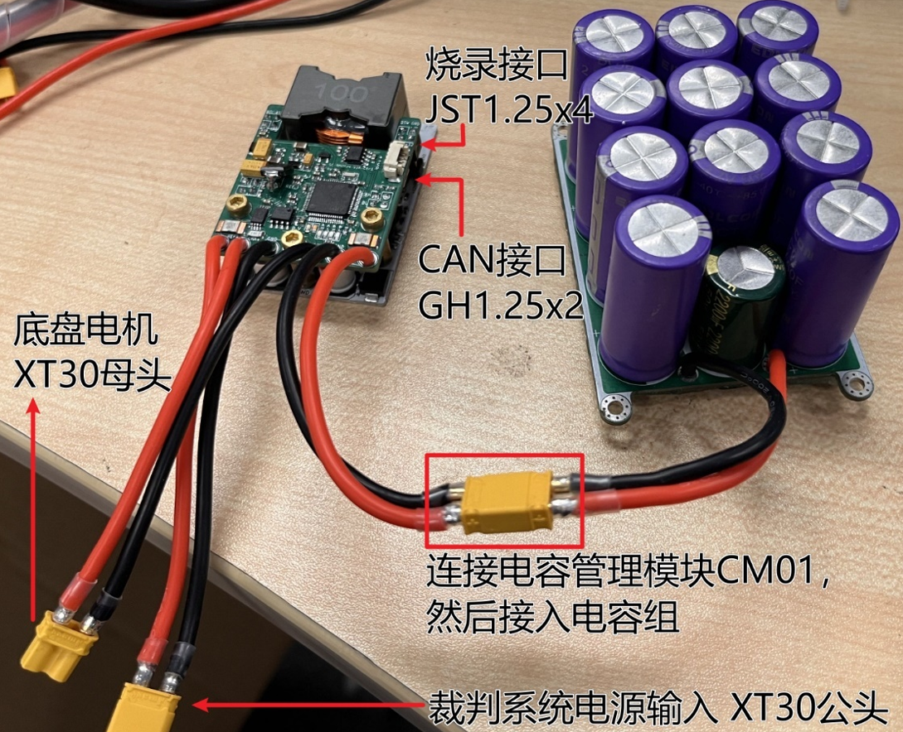

# 香港科技大学ENTERPRIZE战队
# RM2024超级电容控制器
# 硬件方案&软件方案 完全开源


>设计者：蒋益诚 戎羿
> 
>文档撰写：戎羿


## 文件结构

```
Calibration/cal.xlsx                              ----校准用Excel工具表
Core                                              ----核心代码文件
Docs                                              ----文档附图源码
Drivers                                           ----STM32驱动文件
hardware                                          ----硬件项目文件
      --    SuperCap2024_Control_V1.1R_F3_ISOPWR  ----控制板Kicad项目文件
      --    SuperCap2024_Power_V1.2R              ----功率板Kicad项目文件
Middlewares/ST/ARM/DSP/Inc/arm_math.h             ----数学加速库头文件
.clang-format
.clang-tidy
.cproject
CMakeLists.txt                                    ----由CLion生成的CMake编译文件，便于CLion创建项目
CMakeLists_template.txt
Makefile                                          ----由CubeMX生成的MakeFile编译文件
RM2024-SuperCap-F3-V0.2.ioc                       ----STM32CubeMX项目文件
startup_stm32f334x8.s                             ----由CubeMX生成的启动文件
startup_stm32f334x8_SuperCap.s                    ----由CubeMX生成的启动文件改版，当前使用中
STM32F334R8Tx_FLASH.ld                            ----由CubeMX生成的链接文件
STM32F334R8Tx_SuperCap_FLASH.ld                   ----由CubeMX生成的链接文件改版，当前使用中
SuperCap-F3.mk                                    ----队内通用MakeFile库
```

## 使用方法
###	硬件接口&连接

###	软件环境&编译&烧录
本项目基于GCC ARM GNU工具链。
1.	安装GCC环境。以Windows系统下为例，下载MSYS2并安装，在系统环境变量中加入相关目录。
2.	安装`arm-none-eabi-gcc`
      然后即可执行编译操作。需要注意编译时需要指定HARDWARE_ID，否则将会报错。

      `make -j HARDWARE_ID=xxx`

      得到`build/`目录下`RM2024-SuperCap-F3-V1R.elf`文件即为编译成功。

      将elf文件在ozone新建项目中打开，即可通过JLink烧录至MCU中。

## 移植兼容性
该项目通过STM32的HAL库实现大部分去耦，方便移植。

用户代码全部位于 `Core/` 中，将相应文件转移到另生成的项目中可以轻松移植。例如专用STM32G474作为开发用MCU。

而部分相对底层的外设代码，例如HRTIM与ADC的配置等，则需要手动修改。

总体而言该项目可移植性较佳。

## 开源报告
可以见于Github Release处

## 开源说明
本项目通过GPL3.0协议开源

## PCB项目说明
硬件部分使用KiCAD设计。

Github上在线预览：使用[KiCanvas](https://kicanvas.org/)

上板原理图：[预览](https://kicanvas.org/?github=https%3A%2F%2Fgithub.com%2Fhkustenterprize%2FRM2024-SuperCapacitorController%2Fblob%2Fmaster%2Fhardware%2FSuperCap2024_Control_V1.1R_F3_ISOPWR%2FSuperCap2024Control_V1.1R_F3_ISOPWR.kicad_sch)

上板PCB：[预览](https://kicanvas.org/?github=https%3A%2F%2Fgithub.com%2Fhkustenterprize%2FRM2024-SuperCapacitorController%2Fblob%2Fmaster%2Fhardware%2FSuperCap2024_Control_V1.1R_F3_ISOPWR%2FSuperCap2024Control_V1.1R_F3_ISOPWR.kicad_pcb)

下板原理图：[预览](https://kicanvas.org/?github=https%3A%2F%2Fgithub.com%2Fhkustenterprize%2FRM2024-SuperCapacitorController%2Fblob%2Fmaster%2Fhardware%2FSuperCap2024_Power_V1.2R%2FSuperCap2024V1.2R_Power.kicad_sch)

下板PCB：[预览](https://kicanvas.org/?github=https%3A%2F%2Fgithub.com%2Fhkustenterprize%2FRM2024-SuperCapacitorController%2Fblob%2Fmaster%2Fhardware%2FSuperCap2024_Power_V1.2R%2FSuperCap2024V1.2R_Power.kicad_pcb)


